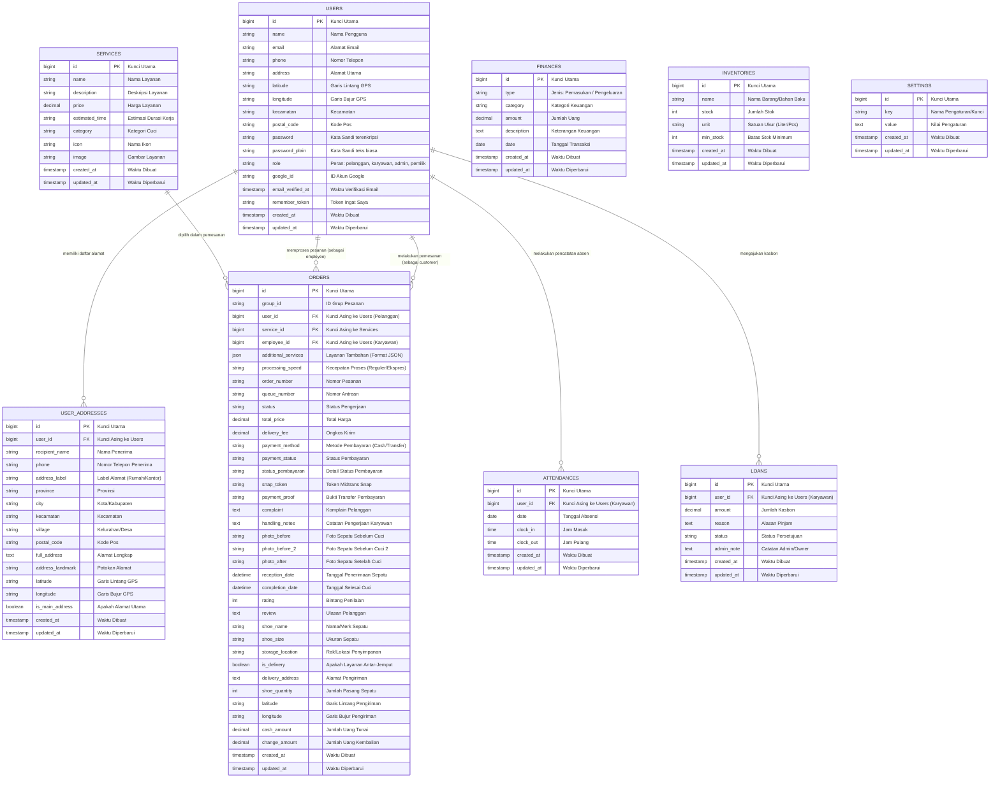

# Dokumentasi ERD & LRS - CleanUp Shoes

Dokumen ini berisi rancangan basis data lengkap berupa **Entity Relationship Diagram (ERD)** dengan **Notasi Chen** (sesuai standar akademik/buku teks) dan **Logical Record Structure (LRS)** untuk aplikasi **CleanUp Shoes**.

---

## 1. Entity Relationship Diagram (ERD) - Notasi Chen

Berikut adalah diagram ERD dengan notasi Chen klasik (Persegi Panjang sebagai Entitas, Belah Ketupat sebagai Relasi, dan Oval sebagai Atribut) berlatar belakang terang sesuai contoh yang Anda berikan:

### Diagram ERD Teknis Interaktif (Mermaid)
Jika Anda membutuhkan representasi Crow's Foot ERD yang interaktif untuk pemrograman/database, berikut adalah diagram Mermaid-nya:

---

## 2. Logical Record Structure (LRS)

LRS (Logical Record Structure) menggambarkan struktur record logis pada tabel-tabel database dengan memperlihatkan relasi kunci utama (Primary Key) ke kunci asing (Foreign Key) secara jelas.

### Visualisasi Konseptual LRS
Berikut adalah visualisasi konseptual dari diagram LRS aplikasi Anda:

### Skema Relasi Tertulis
Relasi struktur tabel secara logis (garis bawah menunjukkan **Primary Key**, tanda bintang/miring menunjukkan **Foreign Key**):

1. **users**
   * ( <u>id</u>, name, email, phone, address, latitude, longitude, kecamatan, postal_code, password, password_plain, role, google_id, email_verified_at, remember_token, created_at, updated_at )

2. **user_addresses**
   * ( <u>id</u>, *user_id* (FK → users.id), recipient_name, phone, address_label, province, city, kecamatan, village, postal_code, full_address, address_landmark, latitude, longitude, is_main_address, created_at, updated_at )

3. **services**
   * ( <u>id</u>, name, description, price, estimated_time, category, icon, image, created_at, updated_at )

4. **orders**
   * ( <u>id</u>, group_id, *user_id* (FK → users.id), *service_id* (FK → services.id), *employee_id* (FK → users.id), additional_services, processing_speed, order_number, queue_number, status, total_price, delivery_fee, payment_method, payment_status, status_pembayaran, snap_token, payment_proof, complaint, handling_notes, photo_before, photo_before_2, photo_after, reception_date, completion_date, rating, review, shoe_name, shoe_size, storage_location, is_delivery, delivery_address, shoe_quantity, latitude, longitude, cash_amount, change_amount, created_at, updated_at )

5. **attendances**
   * ( <u>id</u>, *user_id* (FK → users.id), date, clock_in, clock_out, created_at, updated_at )

6. **loans**
   * ( <u>id</u>, *user_id* (FK → users.id), amount, reason, status, admin_note, created_at, updated_at )

7. **finances**
   * ( <u>id</u>, type, category, amount, description, date, created_at, updated_at )

8. **inventories**
   * ( <u>id</u>, name, stock, unit, min_stock, created_at, updated_at )

9. **settings**
   * ( <u>id</u>, key, value, created_at, updated_at )
